# Sincronizador de arquivos em python

Esse aplicativo em Python foi desenvolvido com o objetivo de facilitar o processo de cópia de fotos e vídeos de câmeras digitais, para um HD externo.  
O aplicativo irá localizar, nos sub-diretórios de destino, arquivos com o mesmo nome e tamanho, evitando assim a cópia desnecessária de arquivos que já foram sincronizdos anteriormente.  

O aplicativo permite que os arquivos de vídeo copiados sejam re-codificados em outros formatos, possibilitando a economia de espaço.  
A conversão dos vídeos é feita utilizando o utilitário [ffmpeg](https://www.ffmpeg.org/).  

**Nota:**  
Para suporte ao Codec H265 (codec recomendado), pode ser necessário recompilar o ffmpeg, habilitando o codec H265, seguindo os passos descritos no [guia de compilação](https://trac.ffmpeg.org/wiki/CompilationGuide) oficial.

## Utilização

A aplicação consiste basicamente de 2 telas:  

### Janela principal

Tela principal do sistema, onde o usuário pode especificar os diretórios de origem e destino e a tela de configuração.

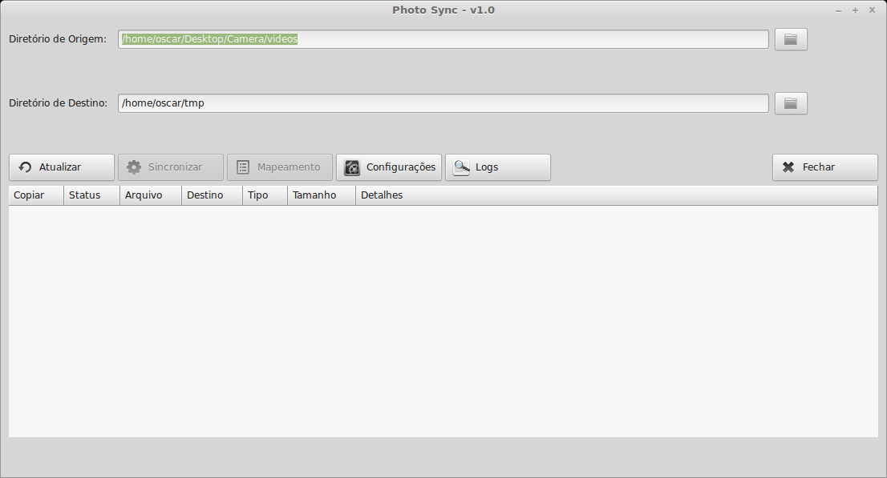

Após selecionar os diretórios de origem e destino, o usuário deve clicar em **Verificar**, onde o sistema irá pesquisar os arquivos na árvore de diretórios de origem e destino, comparando os arquivos por nome e tamanho.  
O aplicativo irá exibir uma grid com a lista de arquivos, informando o tipo, tamanho e possibilitando a seleção para cópia.  
Após selecionar a lista de arquivos que devem ser copiados, o usuário deve clicar no botão **Sincronizar** para que a aplicação copie os arquivos.  

Caso a opção de conversão de vídeo esteja selecionada, o aplicativo irá converter cada video copiado para o formato especificado.  

### Janela de configurações da aplicação.

Tela utilizada para especificar os parâmetros da aplicação.  

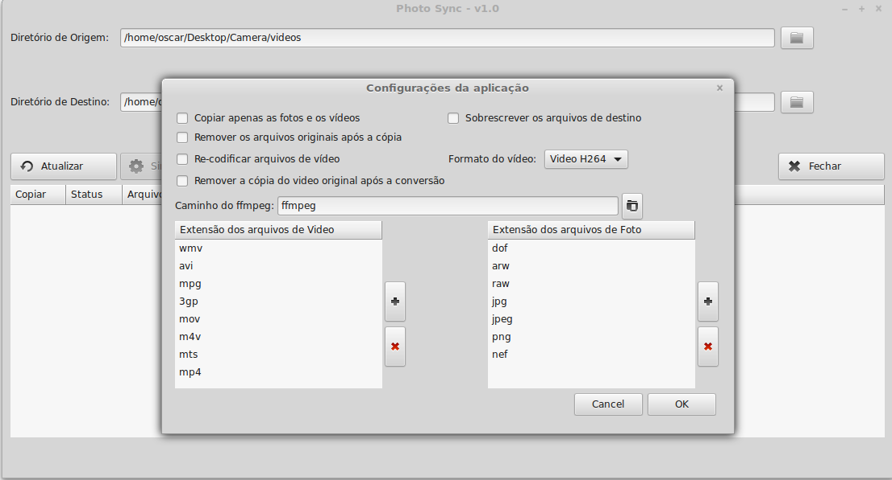

### Janela mapeamento de diretórios.

Essa funcionalidade permite ao usuário mapear os sub-diretórios de destino, onde os arquivos serão copiados, possibilitando efetuar correções em caso os arquivos tenham sido criados com a data incorreta.  


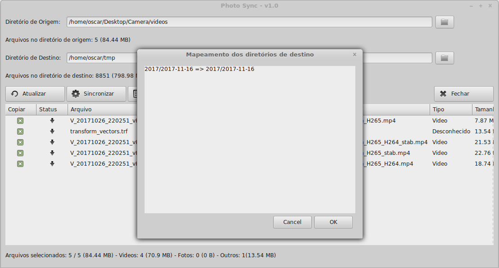


## pré-requisitos para o funcionamento da aplicação

Para o completo funcionamento da aplicação é necessário que as seguintes ferramentas estejam instaladas no sistema:

1. Python `2.7` ou `3.5`.
2. Biblioteca LXML do python.
3. Conversor de mídias ffmpeg

## Instalação dos Requisitos

### Linux

1 - Instalar o Python, o PyPI e o ffmpeg:

```sh
sudo apt-get install python-pip ffmpeg
```

2 - Usando o pyton-pip, instalar a biblioteca `lxml`:

```sh
sudo pip install lxml
```

### Windows

1 - Instalar o [Python 2.7](https://www.python.org/downloads/release/python-2713/) ou [Python 3.5](https://www.python.org/downloads/release/python-363/).

**Importante:**  
Durante a instalação, lembrar de marcar a opção para adicionar o Python ao Path do sistema ou adicionar manualmente a variável de ambiente PATH.

- Instalação do Python

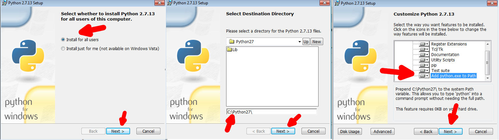

2 - Instalar o [PyGObject for Windows](https://sourceforge.net/projects/pygobjectwin32/files/pygi-aio-3.18.2_rev12-setup_549872deadabb77a91efbc56c50fe15f969e5681.exe/download)

**Importante:**  
Durante a instalação, os seguintes componentes devem ser selecionados: `Base Packages` e `GTK+ 3.18.9` (ver imagens).

- Seleção do diretório onde o Python 2.7 está instalado

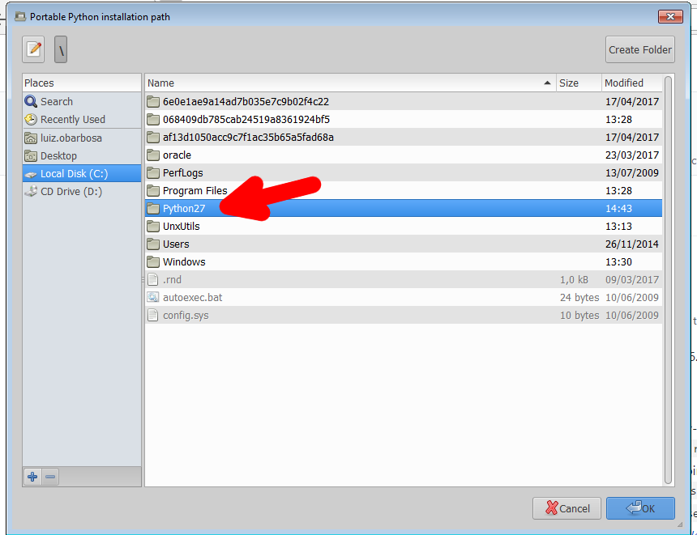

- Seleção da versão do Python 2.7

**Nota:**  
Se a mesma versão aparecer mais de uma vez, selecionar apenas uma.

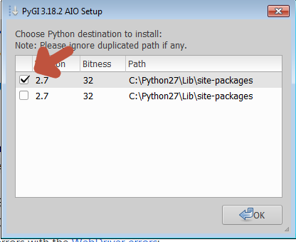

- Seleção dos componentes básicos

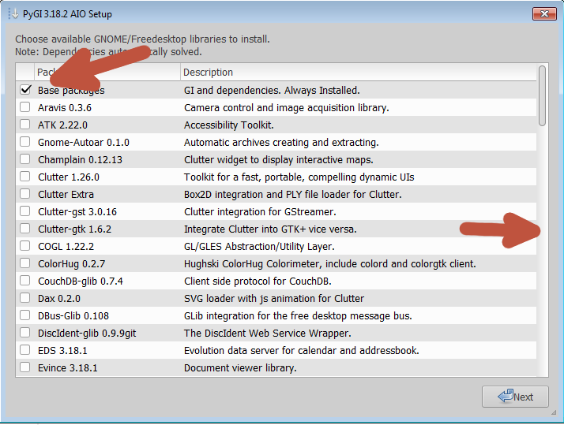

- Seleção dos GTK3+

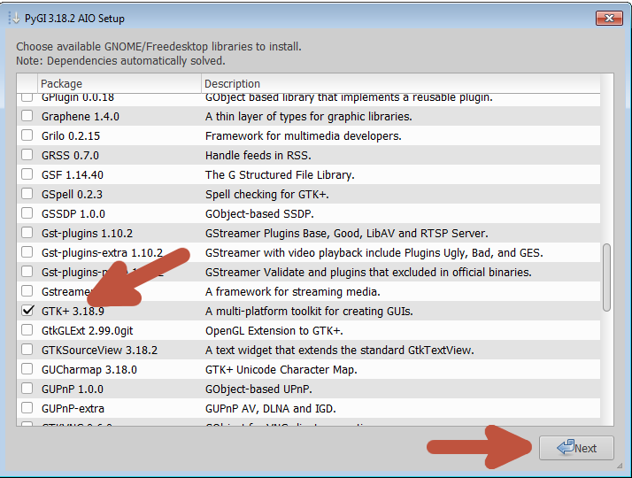

- Ignora pacotes não GNU

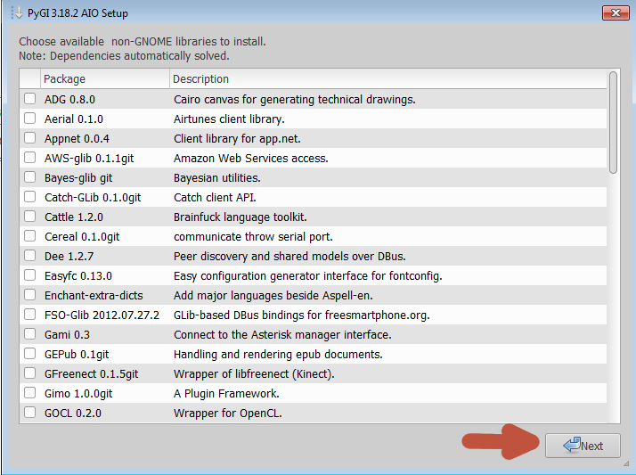

- Ignora pacotes adicionais

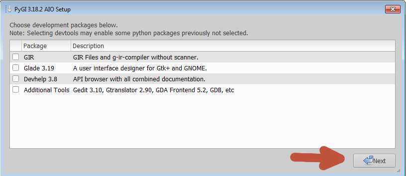

- Confirma a instalação

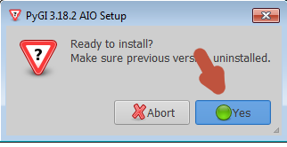

3 - Usando o python pip via Linha de Comando, instalar a biblioteca `lxml`:

```sh
pip install lxml
```
4 - Instalar e configurar o [ffmpeg](https://www.ffmpeg.org/download.html).
